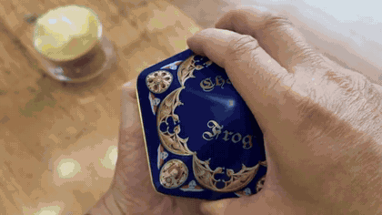
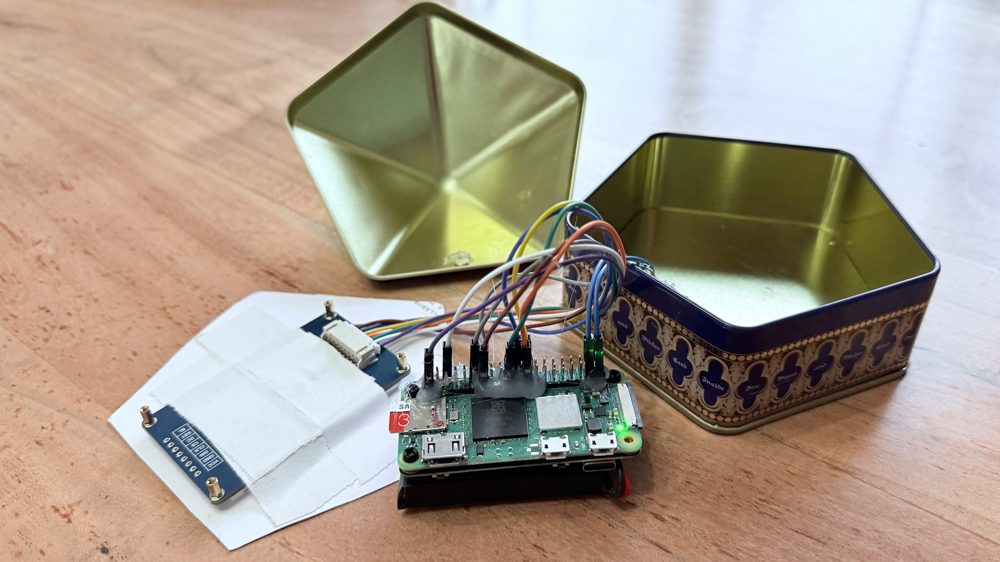
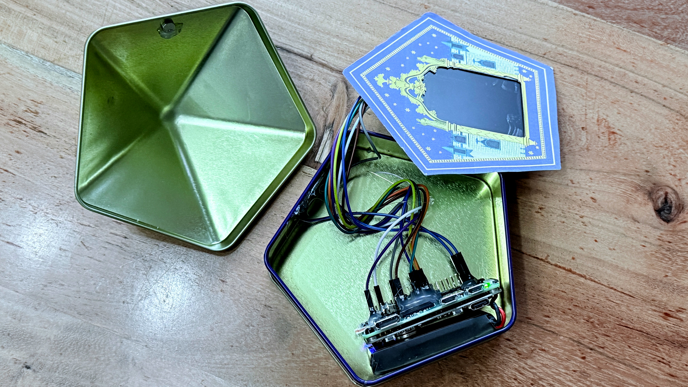
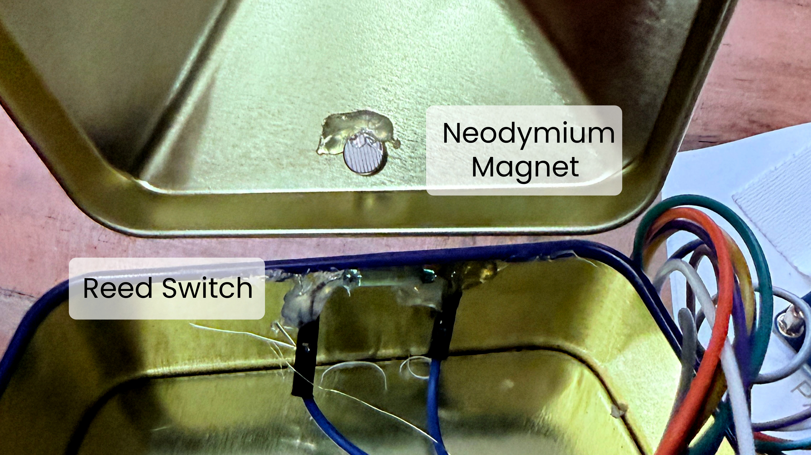

# Animated Wizard Card in a Chocolate Frog Tin

My kids were so excited to visit Honeydukes at the Wizarding World in Universal Studios Florida and get their hands on some Chocolate Frogs. They loved the tins and the wizard cards inside, which actually had a pretty cool effect using lenticular printing. But I wanted to make them better. More realistic. Moving portraits, just like in the films.

So I built one.

This is a real Chocolate Frog tin with an animated wizard portrait inside. When you open the lid, a random wizard comes to life on a tiny screen embedded in the card. Close the lid and it goes dark, ready to surprise you with a different wizard next time.

<p align="center">
  
</p>

> **[Watch the full demo video →](final-product/demo.mp4)**

---

## How It Works

1. A **reed switch** inside the tin detects when the lid opens (magnet in the lid moves away)
2. A **Python script** picks a random wizard animation
3. **ffmpeg** plays the video directly to the LCD framebuffer
4. When the video ends, the **last frame stays on screen** — like a real portrait
5. Close the lid and the screen **immediately goes black**
6. Everything runs on battery via a **PiSugar 3** — no wires, just open and enjoy

---

## The Build

<p align="center">
  
</p>

<p align="center"><em>Pi Zero 2 WH + PiSugar 3 battery + Waveshare 2.4" LCD</em></p>

<p align="center">
  
</p>

<p align="center"><em>Everything fits inside a standard Chocolate Frog tin</em></p>

<p align="center">
  
</p>

<p align="center"><em>Reed switch in the base, neodymium magnet in the lid</em></p>

---

## Characters

| Wizard | Animation |
|--------|-----------|
| Godric Gryffindor | Warm greeting, nod, then walks away |
| Salazar Slytherin | Cold stare, sinister nod, then walks away |
| Rowena Ravenclaw | Knowing smile, wave, then walks away |
| Helga Hufflepuff | Friendly wave, then walks away |
| Albus Dumbledore | Warm nod and wave, then walks away |

Animations generated from portrait stills using [Kling](https://klingai.com/) AI. 8 seconds each, 24fps.

---

## Hardware

| Component | Purpose |
|-----------|---------|
| **Raspberry Pi Zero 2 WH** | Brain — pre-soldered headers, no soldering needed |
| **Waveshare 2.4" ILI9341 LCD** | 240x320 SPI display |
| **PiSugar 3** | Battery + charging + 5V boost — pogo pin connection |
| **Reed switch + magnet** | Detects lid open/close |
| **Samsung 32GB MicroSD** | Stores OS and animations |
| **Dupont wires** | Connects LCD to Pi GPIO |
| **Hot glue** | Secures dupont connectors |

Full parts list with links in the [PRD](PRD.md).

---

## Wiring

| LCD Pin | Pi Pin | Physical Pin |
|---------|--------|-------------|
| VCC | 3.3V | 1 |
| GND | GND | 6 |
| DIN | SPI0 MOSI | 19 |
| CLK | SPI0 SCLK | 23 |
| CS | SPI0 CE0 | 24 |
| DC | GPIO 25 | 22 |
| RST | GPIO 27 | 13 |
| BL | GPIO 18 | 12 |

Reed switch: **GPIO 26** (Pin 37) → **GND** (Pin 39)

---

## Printables

Two PDF templates for the card overlay:

| File | What It Is |
|------|-----------|
| [`wizard-card-print.pdf`](printables/wizard-card-print.pdf) | Full card — print on heavy cardstock with a color printer |
| [`wizard-card-cutout.pdf`](printables/wizard-card-cutout.pdf) | Portrait window — send to a laser cutter to cut the viewing area |

---

## Quick Start

```bash
# SSH into the Pi
ssh pi@wizardcard.local

# Enable SPI and install ffmpeg
sudo raspi-config nonint do_spi 0
sudo apt install -y ffmpeg

# Add display overlay to /boot/firmware/config.txt
# (append this line to the end of the file)
dtoverlay=fbtft,spi0-0,ili9341,bgr,reset_pin=27,dc_pin=25,led_pin=18,rotate=0,speed=32000000,fps=60,width=240,height=320

# Reboot to activate SPI and display
sudo reboot

# From your computer — copy everything to the Pi in one shot
scp -r pi-files/* pi@wizardcard.local:~/

# SSH back in and install the service
ssh pi@wizardcard.local
sudo cp ~/wizard-card.service /etc/systemd/system/
sudo systemctl daemon-reload
sudo systemctl enable wizard-card
sudo systemctl start wizard-card
```

Full step-by-step instructions in the **[Build Guide](BUILD_GUIDE.md)**.

---

## Repo Structure

```
chocolate-frog-tin/
├── README.md              ← You are here
├── PRD.md                 ← Product requirements, specs, parts list
├── BUILD_GUIDE.md         ← Step-by-step build instructions
├── pi-files/              ← Everything for the Pi
│   ├── wizard-card.py     ← Control script
│   ├── wizard-card.service
│   ├── config.txt         ← Boot config reference
│   ├── cmdline.txt        ← Kernel command line reference
│   └── animations/        ← Pre-formatted 240x320 animations
├── printables/            ← PDF templates for the card
│   ├── wizard-card-print.pdf
│   └── wizard-card-cutout.pdf
└── final-product/         ← Photos and demo video
    ├── demo.gif           ← Animated preview for README
    ├── demo.mp4
    └── *.jpg
```

---

## Tips

- **Use `fbtft`, not `fbcp-ili9341`.** Raspbian Trixie (Debian 13) removed the legacy VideoCore libraries. The `fbtft` kernel dtoverlay works out of the box.
- **ffmpeg direct to framebuffer** is all you need for video playback on an SPI display. No mpv, no vlc, no desktop.
- **PiSugar 3** eliminates all battery wiring — pogo pins connect through the back of the Pi. USB-C charging built in.
- **Hot glue your dupont connectors** to the GPIO header. They will come loose inside the tin otherwise.
- **Add `quiet vt.global_cursor_default=0 logo.nologo`** to `cmdline.txt` so the LCD boots to a clean black screen instead of showing kernel messages and a blinking cursor.
- **Disable `getty@tty1`** so the login prompt doesn't appear on the LCD.

---

## Built With

- [Claude Code](https://claude.ai) — All software written and deployed via Claude Code over SSH
- [Kling](https://klingai.com/) — AI-generated wizard portrait animations
- Raspberry Pi Zero 2 WH
- Lots of hot glue

## License

MIT
